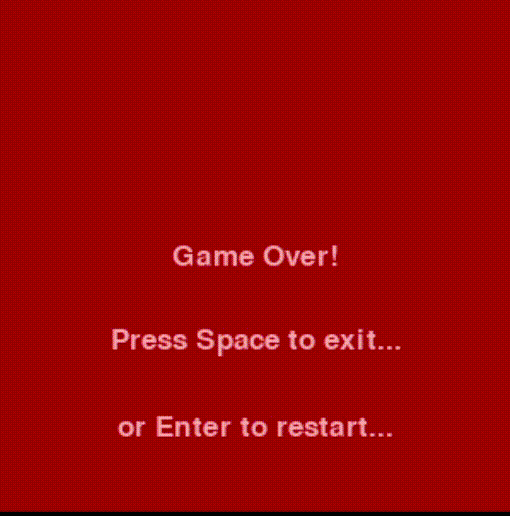

# Snake Game

## Overview

Welcome to my Snake Game! This classic game is built with Python using the Pygame library, offering a fun and engaging gaming experience for all users. Control the snake, feed it, and watch it grow while avoiding collisions with the game boundaries and its own tail.

## Features

- Easy-to-use controls for seamless gameplay
- Simple yet captivating graphics and visual effects
- Smooth and responsive movements for an enjoyable gaming experience
- Dynamic food generation to keep the game challenging and exciting
- Score tracking and display to monitor progress and achievements

## Description

This project demonstrates my skills in Python programming and game development using the Pygame library. Through this project, I have honed my abilities in:
- Implementing game logic and mechanics
- Handling user input and controls
- Managing collision detection and game states
- Creating engaging visual and audio effects
- Packaging the game into an executable file for easy distribution

## Usage

Simply download the Snake_Game.exe file from the repository to your local machine.

Double-click the Snake_Game.exe file to launch the game. Use the arrow keys to control the snake's direction. Aim to collect the food and avoid collisions with the boundaries and your own tail.

## For development:

 Create and Activate the environment:

python -m venv venv   

 Activate on Linux/Mac

source venv/bin/activate 

  Activate on Windows

venv\Scripts\activate      

 Install Dependencies

pip install -r requirements.txt

## Contribution

Contributions are always welcome! If you have any suggestions, issues, or want to contribute to the project, please feel free to open an issue or submit a pull request.
